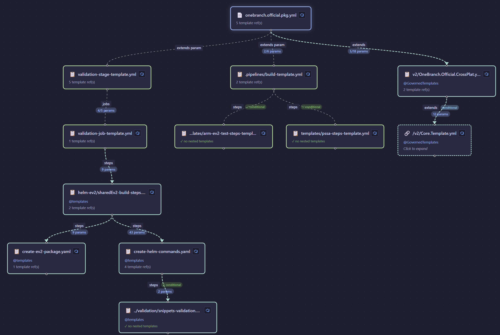
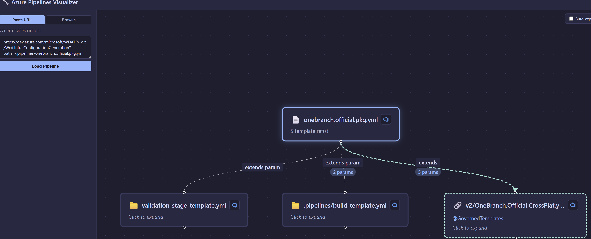
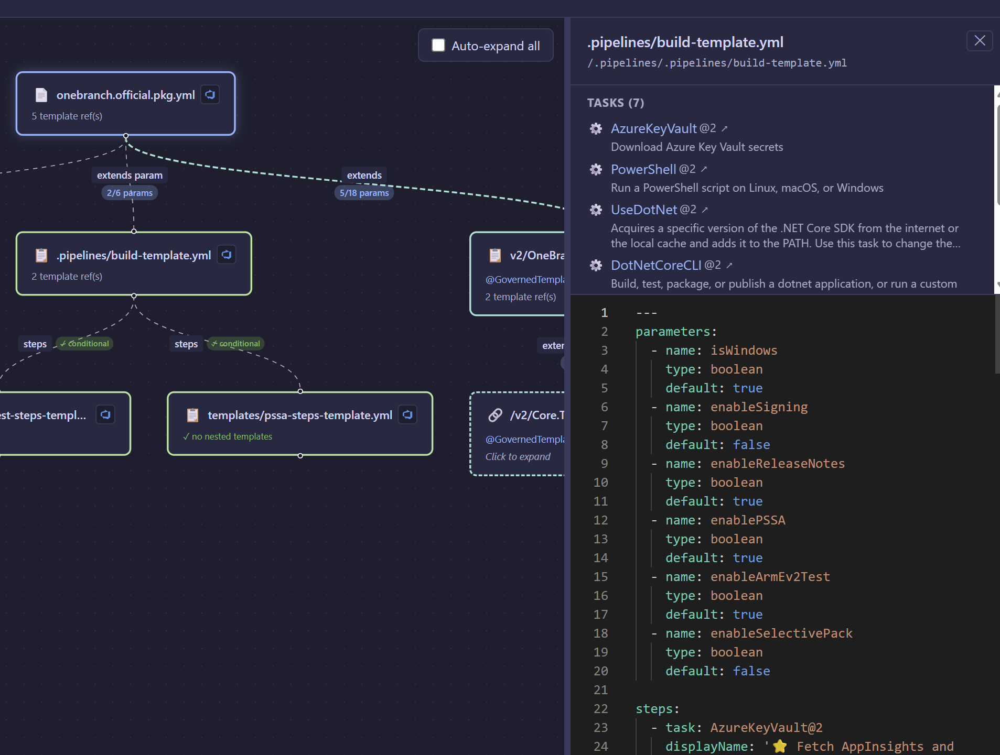
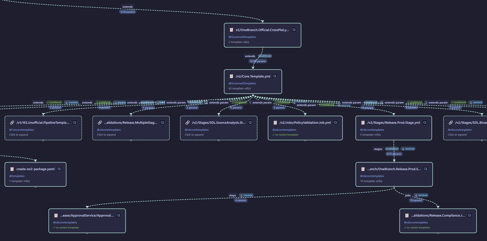

# Azure Pipelines Visualizer

[](https://github.com/Meir017/azure-pipelines-visualizer/actions/workflows/ci.yml)
[](https://www.npmjs.com/package/@meirblachman/azure-pipelines-visualizer)
[](https://www.npmjs.com/package/@meirblachman/azure-pipelines-visualizer-web)

An interactive visualizer for Azure DevOps pipelines. Two main views:

- **Pipeline Templates** — paste a pipeline URL and explore its template hierarchy as an expandable diagram with YAML preview and task documentation links.
- **Commit Flow** — paste a commit URL and see the full tree of pipelines that ran for it, including cross-project trigger chains.

## Pipeline Templates

Visualize how pipeline YAML files reference templates across repositories. Expand nodes to drill into the full template tree, view YAML source, and browse task documentation.

### Paste a URL and load the pipeline



### Expand templates to explore the full hierarchy



### Drill into cross-repo template trees



### View YAML and task documentation in the detail panel



## Commit Flow

Visualize the full chain of pipelines triggered by a commit. The tool discovers downstream builds via `buildCompletion` and `resourceTrigger` mechanisms, including cross-project triggers when configured.

- Paste an Azure DevOps commit URL (e.g. `https://dev.azure.com/{org}/{project}/_git/{repo}/commit/{sha}`)
- Builds stream in progressively via SSE as the BFS traversal discovers them
- Click any build node to see details — pipeline name, build number, branch, and commit are all clickable links to Azure DevOps
- Cross-project builds are labeled with a project badge
- Configure `relatedProjectGroups` in `apv.config.json` to discover triggers across related ADO projects

## Chrome Extension

A companion Chrome extension that enhances Azure DevOps commit pages directly in the browser. See [`packages/chrome-extension/README.md`](packages/chrome-extension/README.md) for details.

- Injects into ADO's build status sidebar — no separate UI
- Shows triggered pipeline trees inline with expand/collapse toggles
- Cross-project discovery via configurable project groups (Options page)
- ADO-native styling with dark/light theme support
- No server required — uses ADO REST APIs directly via browser cookies


## Quick Start with npx

The fastest way to run the visualizer — no installation required:

```bash
npx @meirblachman/azure-pipelines-visualizer
```

> Requires Node.js ≥ 24 and Azure CLI logged in (`az login`).

Open http://localhost:3001. The command bundles both the API server and web UI.

### CLI Options

```
Usage: apv [options]

Options:
  -c, --config <path>  Path to apv.config.json
  -p, --port <number>  Port to listen on (default: 3001)
  -h, --help           Show this help message
  -v, --version        Show version number
```

Examples:

```bash
# Use a custom config file and port
npx @meirblachman/azure-pipelines-visualizer --config ./my-config.json --port 8080

# Short flags work too
npx @meirblachman/azure-pipelines-visualizer -c ./my-config.json -p 8080
```

The `PORT` environment variable is still supported as a fallback when `--port` is not specified.

## Web Library

The visualizer is also available as a React component library for embedding in your own apps or Chrome extensions:

```bash
npm install @meirblachman/azure-pipelines-visualizer-web
```

### React

```tsx
import { App } from '@meirblachman/azure-pipelines-visualizer-web';
import '@meirblachman/azure-pipelines-visualizer-web/dist/lib/style.css';
import '@xyflow/react/dist/style.css';

// Load by pipeline definition ID
<App org="myorg" project="myproject" pipelineId={42} />

// Load by file URL
<App fileUrl="https://dev.azure.com/myorg/myproject/_git/myrepo?path=/.pipelines/main.yml" />

// Load by repo path
<App org="myorg" project="myproject" repo="myrepo" path="/.pipelines/main.yml" />
```

### Vanilla JS / Chrome extension (no React needed)

```js
import { mount } from '@meirblachman/azure-pipelines-visualizer-web';

const handle = mount(document.getElementById('root'), {
  org: 'myorg',
  project: 'myproject',
  pipelineId: 42,
});

handle.update({ pipelineId: 99 }); // update
handle.unmount();                   // clean up
```

> **Chrome extensions:** The library auto-detects `chrome-extension:` protocol and talks directly to Azure DevOps REST APIs using browser cookies — no server required.

See the full [web library documentation](packages/web/README.md) for all props, exports, and CDN usage.

## Development Setup

### Prerequisites

- [Bun](https://bun.sh/) v1.0+
- Azure CLI logged in (`az login`) — required for fetching files from Azure DevOps

### Quick Start

```bash
bun install
bun run dev
```

This starts a single dev server at http://localhost:3000 serving both the API and web UI with hot reload.

## Production

```bash
bun install
bun run build   # Build the web UI
bun run start   # Start the production server
```

Open http://localhost:3000.

## Usage

The app has two views, accessible via the navigation tabs at the top.

### Pipeline Templates

1. Paste an Azure DevOps file URL, e.g.:
   ```
   https://dev.azure.com/{org}/{project}/_git/{repo}?path=/.pipelines/main.yml
   ```
2. Click **Load Pipeline** — the root file and its template references appear as a diagram.
3. Click any template node to expand it and fetch its contents recursively.
4. Click an expanded node to view its YAML and task list in the detail panel.

### Commit Flow

1. Switch to the **Commit Flow** tab.
2. Paste an Azure DevOps commit URL, e.g.:
   ```
   https://dev.azure.com/{org}/{project}/_git/{repo}/commit/{sha}
   ```
3. Click **Load** — builds stream in progressively as they are discovered.
4. Click any build node to open a detail popup with clickable links to Azure DevOps (build results, pipeline definition, branch, commit).
5. Cross-project triggered builds appear with a project badge when `relatedProjectGroups` is configured.

## Disk Cache

Fetched pipeline and template files are cached on disk under `.cache/ado-file-cache` by default, so you do not need local Git clones for template repos. Cache entries are keyed by:

- repo identity
- normalized file path
- requested branch or tag
- resolved Git commit SHA

This keeps cache hits accurate even when a branch moves forward.

You can optionally override the cache location and configure cross-project discovery in `apv.config.json`:

```jsonc
{
  "cacheDir": ".cache/ado-file-cache",
  "customTaskDocs": {
    "OneBranch.Pipeline.Build@1": "https://example.com/docs/build-task"
  },
  "relatedProjectGroups": [
    [
      { "id": "aaaaaaaa-bbbb-cccc-dddd-eeeeeeeeeeee", "name": "ProjectA" },
      { "id": "ffffffff-1111-2222-3333-444444444444", "name": "ProjectB" }
    ]
  ]
}
```

| Key | Description |
|-----|-------------|
| `cacheDir` | Directory for the on-disk file cache (default: `~/.apv/cache/ado-file-cache`) |
| `customTaskDocs` | Map task names to custom documentation URLs |
| `relatedProjectGroups` | Groups of related ADO projects for cross-project trigger discovery in Commit Flow |

## Scripts

| Command | Description |
|---------|-------------|
| `bun run dev` | Start dev server (API + web UI with HMR) |
| `bun run build` | Build the web UI for production |
| `bun run start` | Start the production server |
| `bun test` | Run all tests |
| `bun run lint` | Lint with Biome |
| `bun run lint:fix` | Lint and auto-fix |
| `bun run build:standalone` | Build a self-contained executable |

## Standalone Binary

Pre-built binaries for Linux, macOS, and Windows are available on the [Releases](https://github.com/Meir017/azure-pipelines-visualizer/releases) page.

### Download and run

```bash
# Download the binary for your platform from the latest release, then:
chmod +x apv-linux-x64   # Linux/macOS only
./apv-linux-x64
```

Open http://localhost:3001. The binary bundles both the API server and web UI.

### Configuration

Pass options via CLI flags (same flags as the npm package):

```bash
./apv-linux-x64 --config ./apv.config.json --port 8080
```

The `APV_CONFIG` environment variable is also supported as a fallback:

```bash
APV_CONFIG=./apv.config.json ./apv-linux-x64
```

See [`apv.config.example.json`](apv.config.example.json) for available options.

### Build from source

```bash
bun install
bun run build:standalone    # produces ./apv (or apv.exe on Windows)
./apv
```

## Project Structure

```
packages/
  core/              # Pipeline model, YAML parser, template detector, expression evaluator
  server/            # Hono API server (ADO proxy + disk-backed file cache)
  web/               # React + Vite frontend (ReactFlow diagram, Monaco editor, npm library)
  cli/               # CLI wrapper — bundles server + web for npx usage
  chrome-extension/  # Chrome extension — injects into ADO sidebar with pipeline trigger trees
```
