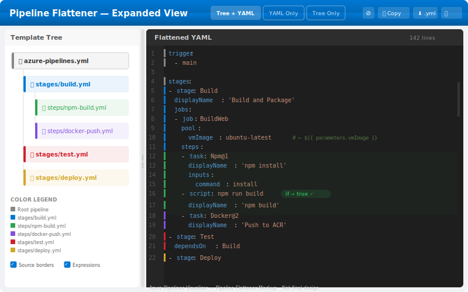

# Feature Proposal: Expanded Pipeline Flattener




## Summary

A split-pane view that shows the fully-resolved, flattened pipeline YAML after all templates have been expanded, expressions evaluated, and conditions applied — side-by-side with the original template tree. Each section of the flattened output is color-annotated to indicate which source template it originated from.

## Problem

When working with complex Azure Pipelines that use deeply nested templates, parameters, and conditional expressions, developers struggle to understand:

- What the final, effective pipeline YAML looks like after all template expansion.
- Which template contributed which section of the final pipeline.
- How parameter values flow through the template chain and affect the final output.
- Whether conditional blocks (`${{ if }}`) are included or excluded in the final result.

Currently, the only way to see the expanded pipeline is to queue a build and inspect the "expanded YAML" in Azure DevOps — which requires a build run and doesn't show source attribution.

## How Expansion Works (Already in Core)

The `@meirblachman/azure-pipelines-visualizer-core` package already contains the machinery for full template expansion:

### Existing Infrastructure

- **`packages/core/src/resolver/template-expander.ts`** — Full template expansion engine that:
  - Recursively resolves `template:` references
  - Merges parameter defaults with provided values
  - Evaluates `${{ }}` expressions (parameters, variables, built-in functions)
  - Processes conditional `${{ if }}` / `${{ else }}` blocks
  - Handles `${{ each }}` loop expansion

- **`packages/core/src/parser/expression-evaluator.ts`** — Complete expression parser/evaluator:
  - Tokenizer → AST → evaluator pipeline
  - Supports `parameters.*`, `variables.*`, and all ADO built-in functions
  - Used by the template expander for condition evaluation and expression resolution

- **`packages/core/src/parser/expression-path-resolver.ts`** — Resolves `${{ }}` expressions in template paths using merged parameter + variable context

- **`packages/core/src/parser/template-detector.ts`** — Walks raw YAML to extract `TemplateReference` objects

### What's Needed

The expansion engine produces the flattened YAML. What's missing is:

1. **Source attribution**: Tracking which template each section of the output came from
2. **UI rendering**: A split-pane view that visualizes the result
3. **Linking**: Bidirectional navigation between flattened output and source templates

## What It Shows

### Left Pane: Template Tree (Compact)

A miniaturized version of the existing template tree visualization:

- Root pipeline file at the top
- Nested template references as child nodes
- Each template node has a unique color assignment
- Clicking a node highlights all sections in the right pane that came from that template
- Shows parameter values passed to each template

### Right Pane: Flattened YAML

The fully-expanded pipeline YAML with:

- **Syntax highlighting**: Standard YAML syntax coloring
- **Source annotations**: A colored left-border strip on each line indicating which template it came from
  - Colors match the template nodes in the left pane
  - Root pipeline content has no border (or a neutral gray)
  - Each template gets a distinct, visually distinguishable color
- **Fold markers**: Sections that came from a single template can be collapsed
- **Condition indicators**: Lines that were included due to a conditional expression show a small badge (e.g., `${{ if eq(...) }} → true`)
- **Expression resolution**: Original expressions shown as faded comments, resolved values shown inline
  - Example: `image: ubuntu-latest  # ← ${{ parameters.vmImage }}`

### Header Bar

- **View toggle**: "Tree + YAML" | "YAML Only" | "Tree Only"
- **Show/hide controls**:
  - Toggle source annotations
  - Toggle resolved expression comments
  - Toggle condition badges
- **Copy button**: Copy flattened YAML to clipboard
- **Download button**: Download as `.yml` file
- **Search**: Find text in the flattened YAML

## Interaction Model

| Action                           | Behavior                                                  |
| -------------------------------- | --------------------------------------------------------- |
| Click template node (left pane)  | Highlight all lines from that template in the right pane  |
| Click colored border (right pane)| Highlight the source template node in the left pane       |
| Hover over resolved value        | Tooltip showing original expression and resolution chain  |
| Hover over condition badge       | Tooltip showing the full condition expression and result   |
| Click fold marker                | Collapse/expand a template-sourced section                |
| Ctrl+F / Cmd+F                   | Search within the flattened YAML                          |
| Copy button                      | Copy flattened YAML (without annotations) to clipboard    |
| Toggle annotations               | Show/hide the colored source borders                      |
| Resize divider                   | Drag to resize left/right pane ratio                      |

## Where It Lives

### Web Application

- **New tab/panel**: "Flattened View" tab in the existing template visualizer
  - Sits alongside the current "Template Tree" tab
  - Available once all templates have been loaded and expanded
- **New route**: `/flatten/:organization/:project/:repoId/:path`
  - Deep-linkable flattened view for a specific pipeline file

### Integration with Existing Views

- **Template tree toolbar**: "Flatten Pipeline" button that switches to the flattened view
- **Node context menu**: "View flattened contribution" option on each template node — opens flattened view scrolled to that template's content
- **Bidirectional linking**: Selecting content in either pane highlights the corresponding content in the other

## Implementation Approach

### Core (Minimal Changes)

1. **Source tracking in template expander**:
   - Extend the expansion result to include source attribution metadata
   - Each line/block in the output carries: `{ sourceTemplate: string, lineRange: [number, number], condition?: string }`
   - This is an additive change — the expander already walks the template tree, we just annotate the output

2. **New type**: `FlattenedPipeline`
   ```typescript
   interface FlattenedLine {
     content: string;
     sourceTemplate: string;  // file path of the originating template
     originalExpression?: string;  // if this line had an expression that was resolved
     conditionExpression?: string;  // if this line was inside a conditional block
     conditionResult?: boolean;
   }

   interface FlattenedPipeline {
     lines: FlattenedLine[];
     templateColors: Map<string, string>;  // template path → assigned color
   }
   ```

### Server

1. **New endpoint**: `GET /api/flatten/:organization/:project/:repoId/*path`
   - Fetches the root pipeline and all referenced templates
   - Runs the template expander with source tracking enabled
   - Returns the `FlattenedPipeline` result
   - Caches by commit SHA (same cache strategy as existing template fetching)

### Web (React)

1. **New component**: `PipelineFlattener.tsx` — main split-pane container
   - Manages pane sizing (draggable divider)
   - Coordinates highlighting between panes

2. **Left pane**: `FlattenedTreeView.tsx`
   - Compact template tree using the existing `ReactFlow` nodes
   - Color legend showing template → color mapping
   - Click handlers for cross-pane highlighting

3. **Right pane**: `FlattenedYamlView.tsx`
   - YAML rendering with syntax highlighting (use `Prism` or custom tokenizer)
   - Colored left-border strips per line
   - Fold/expand sections
   - Expression and condition annotations

4. **Toolbar**: `FlattenerToolbar.tsx`
   - View toggle, annotation controls, copy/download buttons, search

5. **Data layer**: `useFlattenedPipeline` hook
   - Orchestrates template fetching and expansion
   - Computes color assignments for templates
   - Manages highlight state

### Color Assignment

Templates are assigned colors from a perceptually distinct palette:

```typescript
const TEMPLATE_COLORS = [
  '#0078d4', // Azure blue
  '#2da44e', // Green
  '#cf222e', // Red
  '#8250df', // Purple
  '#d4a72c', // Amber
  '#0969da', // Light blue
  '#bf3989', // Pink
  '#1a7f37', // Dark green
  '#9a6700', // Brown
  '#0550ae', // Navy
];
```

Colors are assigned in tree-traversal order (root pipeline gets no color / neutral, first template gets color[0], etc.).

### Dependencies

- No new heavy dependencies
- YAML syntax highlighting: reuse existing or add `prismjs` (lightweight, tree-shakeable)
- Split pane: CSS Grid with a draggable divider (no library needed)

## Open Questions

1. Should the flattened view be available before all templates are loaded, showing partial results with placeholders?
2. How should we handle templates that are referenced multiple times (same template, different parameters)?
3. Should we support exporting the flattened YAML with source annotations as comments?
4. How deep should expression resolution comments go (just the final value, or the full resolution chain)?
5. Should the flattened view support editing and "what-if" parameter changes?

## Mockup

See [03-pipeline-flattener-mockup.svg](./03-pipeline-flattener-mockup.svg) for a visual mockup of the split-pane view.
