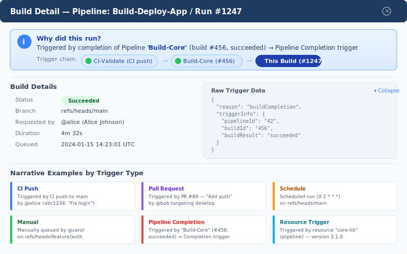

# Feature 4: "Why Did This Run?" Explainer




## Summary

Generate a human-readable narrative explaining why any given build was triggered, replacing cryptic `build.reason` codes with clear, contextual sentences. Display the full trigger chain as a breadcrumb trail when pipelines trigger other pipelines.

## Motivation

When investigating build failures or unexpected runs, the first question is always "why did this run?" Today, users must manually inspect `build.reason`, cross-reference `build.triggerInfo`, and trace pipeline completion triggers across multiple builds. This feature surfaces that information instantly.

## Data Sources

### Primary Fields

| Field | Description | Example |
|---|---|---|
| `build.reason` | Enum trigger type | `ci`, `pullRequest`, `manual`, `buildCompletion`, `resourceTrigger`, `schedule` |
| `build.triggerInfo` | Trigger metadata object | `{ "ci.sourceBranch": "refs/heads/main", "ci.message": "Fix login bug" }` |
| `build.sourceBranch` | Branch that triggered the build | `refs/heads/main` |
| `build.requestedFor` | User identity (display name + unique name) | `{ displayName: "Alice", uniqueName: "alice@contoso.com" }` |
| `build.requestedBy` | System or user that queued | Same identity shape |

### Pipeline Completion Trigger Fields

When `build.reason === 'buildCompletion'`, `triggerInfo` contains:

- `triggerInfo["pipelineId"]` — ID of the upstream pipeline definition
- `triggerInfo["buildId"]` — ID of the triggering build
- `triggerInfo["buildResult"]` — Result of the upstream build (succeeded, failed, etc.)

### Resource Trigger Fields

When `build.reason === 'resourceTrigger'`, the `resources` section of the YAML defines which resource (pipeline, repository, container, package) caused the trigger.

## Narrative Templates

### Per Reason Type

**CI Push (`ci`)**
> Triggered by CI push to `{branch}` by @{requestedFor} (commit `{shortSha}`: "{commitMessage}")

**Pull Request (`pullRequest`)**
> Triggered by Pull Request #{prId} — "{prTitle}" by @{requestedFor} targeting `{targetBranch}`

**Manual (`manual`)**
> Manually queued by @{requestedFor} on `{sourceBranch}`{parametersNote}

**Pipeline Completion (`buildCompletion`)**
> Triggered by completion of Pipeline "{upstreamName}" (build #{upstreamBuildNumber}, {upstreamResult}) → Pipeline Completion trigger

**Resource Trigger (`resourceTrigger`)**
> Triggered by resource "{resourceAlias}" ({resourceType}) — version {resourceVersion}

**Schedule (`schedule`)**
> Triggered by scheduled run (cron: `{cronExpression}`) on `{sourceBranch}`

### Trigger Chain Breadcrumb

When a build is triggered by pipeline completion, recursively walk `triggerInfo.buildId` → parent build → parent's `triggerInfo` to build the full chain:

```
Pipeline A (CI push by @alice) → Pipeline B (completion) → This Build
```

Each breadcrumb node is a clickable link to that build.

## Where It Appears

### 1. Banner in BuildDetailPopup (Primary)

A prominent blue info banner at the top of the build detail popup:

```
ℹ️ Triggered by CI push to `main` by @alice (commit abc1234: "Fix login bug")
```

### 2. Chrome Extension Badge (Future)

The browser extension can show a tooltip badge on ADO build pages with the narrative.

### 3. Standalone Panel

A dedicated "Trigger Explorer" panel accessible from the build node context menu, showing:
- Full narrative
- Trigger chain breadcrumb (visual)
- Raw trigger data (collapsible JSON)

## Implementation

### Core Package

Add to `packages/core/src/models/`:

```typescript
export interface TriggerNarrative {
  reason: BuildReason;
  summary: string;        // Single-line human-readable
  chain: TriggerChainNode[];
  rawData: Record<string, unknown>;
}

export interface TriggerChainNode {
  pipelineName: string;
  buildNumber: string;
  buildId: number;
  result: string;
  reason: BuildReason;
  narrative: string;
}
```

Add `packages/core/src/trigger-narrator.ts`:

```typescript
export function generateTriggerNarrative(build: Build): TriggerNarrative;
```

This is a pure function (no API calls) — fits the core package's zero-dependency constraint.

### Server Package

Add endpoint: `GET /api/build/{buildId}/trigger-chain`

- Fetches the build via ADO REST API
- Recursively fetches parent builds when `reason === 'buildCompletion'`
- Returns the full `TriggerNarrative` with resolved chain

Cache strategy: trigger chains are immutable once a build completes, so cache indefinitely keyed by `buildId`.

### Web Package

- New `<TriggerBanner>` component renders the narrative as an info banner
- New `<TriggerChainBreadcrumb>` renders the chain as clickable breadcrumb nodes
- Integrate into `BuildDetailPopup` at the top of the content area

## Edge Cases

- **Deleted upstream pipelines**: Show "Pipeline [deleted] (ID: {id})" with a warning icon
- **Deeply nested chains**: Cap at 10 levels with a "…and N more" truncation
- **Missing triggerInfo**: Fall back to `build.reason` display name + `requestedFor`
- **Re-run / retry**: Detect `build.retryOf` and note "Retry of build #{originalBuildNumber}"

## Rollout

1. **Phase 1**: Narrative generation for CI, PR, Manual, Schedule (no chain walking)
2. **Phase 2**: Pipeline completion chain walking + breadcrumb UI
3. **Phase 3**: Resource triggers + Chrome extension badge
