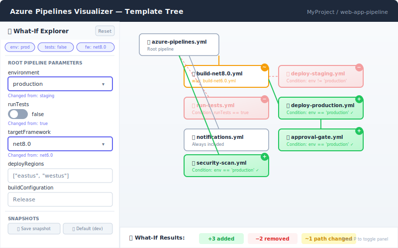

# Feature 8: Parameter "What-If" Explorer




## Summary

An interactive sidebar panel that lets users modify pipeline parameter values and instantly see how the template tree changes — which templates get included or excluded, which conditional branches flip, and which template paths resolve differently. A real-time "what-if" simulator powered by the existing expression evaluator.

## Motivation

Azure Pipelines templates are highly parameterized. A single pipeline can have dozens of parameters that control which stages run, which templates are included, and which deployment targets are active. Today, understanding the effect of a parameter change requires either running the pipeline or mentally tracing through `${{ if }}` conditions and `${{ parameters.X }}` expressions. This is error-prone and slow.

The What-If Explorer eliminates this guesswork by providing instant visual feedback. Engineers can answer questions like:

- "If I set `deployToProduction` to `true`, which additional templates get included?"
- "What happens if I change `targetFramework` from `net6.0` to `net8.0`?"
- "Which stages are skipped when `runTests` is `false`?"

## Core Architecture

### Existing Infrastructure

The codebase already has the key building blocks:

1. **Expression Evaluator** (`packages/core/src/parser/expression-evaluator.ts`): Full tokenizer → AST → evaluator supporting `${{ if eq(parameters.X, 'value') }}`, `${{ parameters.X }}`, logical operators (`and`, `or`, `not`), comparison operators (`eq`, `ne`, `gt`, `lt`), and all Azure Pipelines built-in functions (`contains`, `startsWith`, `in`, `convertToJson`, etc.).

2. **Expression Path Resolver** (`packages/core/src/parser/expression-path-resolver.ts`): Resolves `${{ }}` expressions in template paths. For example, `templates/${{ parameters.environment }}/deploy.yml` becomes `templates/staging/deploy.yml` when `environment = 'staging'`.

3. **Template Detector** (`packages/core/src/parser/template-detector.ts`): Extracts `TemplateReference` objects from YAML, including those inside `${{ if }}` conditional blocks with their condition expressions.

4. **PipelineDiagram** (`packages/web/src/components/PipelineDiagram.tsx`): Already manages parameter context propagation via `_parentParamContext` on node data. Re-evaluation is a matter of updating this context and re-running the tree expansion.

### New Components

```
┌─────────────────────────────────────────────────────────────┐
│                    PipelineDiagram.tsx                       │
│  ┌──────────────────┐    ┌────────────────────────────────┐ │
│  │  ParameterPanel  │    │      Template Tree (ReactFlow) │ │
│  │                  │    │                                │ │
│  │ ┌──────────────┐ │    │   [root] ──► [tmpl-a]         │ │
│  │ │ ParamForm    │ │    │      │                         │ │
│  │ │              │ ├────►      ├──► [tmpl-b] (NEW ✚)     │ │
│  │ │ env: staging │ │    │      │                         │ │
│  │ │ tests: true  │ │    │      └──► [tmpl-c] (REMOVED ─) │ │
│  │ │ framework: ▾ │ │    │                                │ │
│  │ └──────────────┘ │    │                                │ │
│  │                  │    ├────────────────────────────────┤ │
│  │ ┌──────────────┐ │    │  Diff Summary                  │ │
│  │ │ DiffSummary  │ │    │  +3 added  -1 removed  ~2 path │ │
│  │ └──────────────┘ │    └────────────────────────────────┘ │
│  └──────────────────┘                                       │
└─────────────────────────────────────────────────────────────┘
```

## Parameter Form Generation

### Extracting Parameters from YAML

The root pipeline YAML defines parameters in a `parameters:` block:

```yaml
parameters:
  - name: environment
    type: string
    default: 'staging'
    values:
      - dev
      - staging
      - production

  - name: runTests
    type: boolean
    default: true

  - name: targetFramework
    type: string
    default: 'net6.0'

  - name: deployRegions
    type: object
    default:
      - eastus
      - westus

  - name: buildConfiguration
    type: string
    default: 'Release'
```

### Form Control Mapping

| Parameter Type | Form Control | Behavior |
|---------------|-------------|----------|
| `string` with `values` | Dropdown / select | Constrained to allowed values |
| `string` without `values` | Text input | Free-form text |
| `boolean` | Toggle switch | true/false |
| `number` | Number input with stepper | Numeric value |
| `object` | JSON editor (Monaco mini) | Structured data |
| `step`/`stepList`/`job`/`stage` | Read-only display | Too complex for form editing |

### Cascading Parameters

Templates themselves can define parameters with defaults that reference parent parameters:

```yaml
# In child template
parameters:
  - name: env
    type: string
    default: ${{ parameters.environment }}
```

The form shows these as nested, indented parameter groups under their template name. Changing a parent parameter auto-updates child defaults.

## Real-Time Re-Evaluation

### Evaluation Pipeline

When a user changes a parameter value:

1. **Update context**: Merge the new parameter value into the root parameter context object.

2. **Re-evaluate conditions**: For every `TemplateReference` that has a `condition` property, re-run `evaluateExpression(condition, newContext)` using the expression evaluator.

3. **Re-resolve paths**: For every template path containing `${{ }}` expressions, re-run `resolveExpressionPaths(path, newContext)` to get the new resolved path.

4. **Diff computation**: Compare the new tree with the previous tree:
   - **Added nodes**: Templates whose condition flipped from `false` → `true`
   - **Removed nodes**: Templates whose condition flipped from `true` → `false`
   - **Changed paths**: Templates whose resolved path changed (e.g., `templates/staging/deploy.yml` → `templates/production/deploy.yml`)
   - **Unchanged nodes**: Everything else

5. **Update graph**: Apply diff to the ReactFlow graph with animated transitions.

### Debouncing

Text input changes are debounced (300ms) to avoid excessive re-evaluation. Toggle/dropdown changes are immediate.

### Performance

The expression evaluator is synchronous and fast (microseconds per expression). Even a pipeline with 100+ conditional templates will re-evaluate in under 10ms. The bottleneck is React Flow rendering, which is already optimized with virtualization.

## Diff Highlighting

### Node Styling

| State | Visual |
|-------|--------|
| **Added** (condition became true) | Green border + green glow + "+" badge |
| **Removed** (condition became false) | Red border + strikethrough name + "−" badge, faded opacity (0.5) |
| **Path changed** | Orange border + "~" badge, tooltip shows old → new path |
| **Unchanged** | Default styling |

### Diff Summary Bar

A compact bar at the bottom of the template tree:

```
📊 What-If Results: +3 templates added · −1 removed · ~2 paths changed
```

Each count is clickable — clicking "3 templates added" scrolls to and highlights the first added node.

### Animation

- Added nodes slide in from the left with a fade-in
- Removed nodes fade out over 300ms
- Changed edges animate to their new positions
- A subtle pulse animation on newly visible nodes

## UI Integration

### Sidebar Placement

The Parameter Panel lives in a collapsible left sidebar within the existing template visualizer view:

- **Default state**: Collapsed, showing only a "Parameters" tab icon
- **Expanded state**: 320px wide panel with the parameter form
- **Toggle**: Click the tab icon or press `P` keyboard shortcut
- **Resize**: Draggable divider between panel and graph

### Panel Sections

1. **Header**: "What-If Explorer" title + reset button (restore all defaults)
2. **Parameter form**: Grouped by source (root pipeline, then each template)
3. **Active overrides**: Pill badges showing which parameters differ from defaults
4. **Diff summary**: Counts of added/removed/changed
5. **History**: Last 5 parameter combinations as "snapshots" that can be restored

### Keyboard Shortcuts

| Key | Action |
|-----|--------|
| `P` | Toggle parameter panel |
| `R` | Reset all parameters to defaults |
| `Ctrl+Z` | Undo last parameter change |
| `Ctrl+Shift+Z` | Redo parameter change |

## Implementation Plan

### Phase 1: Parameter Extraction (Core)

1. **New module**: `packages/core/src/parser/parameter-extractor.ts`
   - `extractParameters(yaml: string): PipelineParameter[]`
   - Parses the `parameters:` block and returns typed parameter definitions
   - Handles `name`, `type`, `default`, `values` (allowed values), `displayName`

2. **Type definitions**: `packages/core/src/types/parameters.ts`
   ```typescript
   interface PipelineParameter {
     name: string;
     type: 'string' | 'boolean' | 'number' | 'object' | 'step' | 'stepList' | 'job' | 'jobList' | 'stage' | 'stageList';
     default?: unknown;
     values?: string[];
     displayName?: string;
   }
   ```

### Phase 2: What-If Engine (Core)

1. **New module**: `packages/core/src/parser/what-if-evaluator.ts`
   - `evaluateWhatIf(references: TemplateReference[], oldContext: ParamContext, newContext: ParamContext): WhatIfDiff`
   - Runs condition evaluation and path resolution with both contexts
   - Returns structured diff

2. **Diff types**:
   ```typescript
   interface WhatIfDiff {
     added: TemplateReference[];
     removed: TemplateReference[];
     pathChanged: Array<{
       ref: TemplateReference;
       oldPath: string;
       newPath: string;
     }>;
     unchanged: TemplateReference[];
   }
   ```

### Phase 3: Parameter Panel (Web)

1. **Components**:
   - `ParameterPanel.tsx` — sidebar container with collapse/expand
   - `ParameterForm.tsx` — renders form controls based on parameter definitions
   - `DiffSummary.tsx` — bottom bar with change counts
   - `ParameterHistory.tsx` — snapshot management

2. **State management**: Use React context (`WhatIfContext`) to share parameter state between the panel and PipelineDiagram. The context provides:
   - `currentParams: Record<string, unknown>` — current parameter values
   - `defaultParams: Record<string, unknown>` — original defaults
   - `diff: WhatIfDiff | null` — current diff result
   - `setParam(name: string, value: unknown): void` — update a parameter

### Phase 4: Graph Integration (Web)

1. **Modify `PipelineDiagram.tsx`**:
   - Subscribe to `WhatIfContext`
   - On param change, re-run tree expansion with new context
   - Apply diff styling to nodes and edges

2. **Custom node component**: Extend the existing file node to support diff badges and conditional styling.

3. **Animated transitions**: Use React Flow's built-in animation support for node position changes, combined with CSS transitions for opacity and border changes.

## Technical Considerations

- **Pure core package**: All evaluation logic stays in `packages/core` with zero runtime dependencies. The web layer only handles rendering.
- **No network calls**: What-if evaluation is entirely client-side using already-fetched YAML. No additional API calls needed.
- **Nested template parameters**: When a template defines its own parameters, those appear in the form as a nested group. Changing them re-evaluates only that subtree.
- **Circular parameter references**: Detect and break cycles in parameter default expressions to prevent infinite evaluation loops.
- **URL state**: Encode current parameter overrides in the URL query string so what-if scenarios can be shared as links.

## Mockup

See [08-parameter-explorer-mockup.svg](./08-parameter-explorer-mockup.svg) for the visual mockup.
