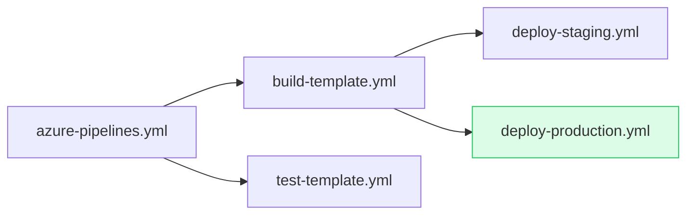
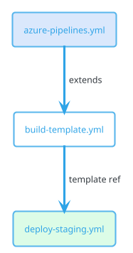

# Feature 9: Export to Diagram Formats

## Summary

An export system that lets users generate portable diagram files from any visualization in the Azure Pipelines Visualizer — template trees, artifact lineage graphs, and commit flow views. Supported formats include Mermaid, Draw.io XML, PlantUML, PNG, SVG, and clipboard copy. Designed for embedding in wikis, ADRs, documentation, and presentations.

## Motivation

Pipeline visualizations are valuable beyond the tool itself. Teams need to:

- **Document architecture**: Embed template dependency trees in wiki pages and Architecture Decision Records (ADRs).
- **Share in reviews**: Paste diagrams into pull request descriptions to show what a YAML change affects.
- **Present to stakeholders**: Include pipeline topology in presentations without requiring live tool access.
- **Audit and compliance**: Export snapshots of pipeline configurations at specific points in time.

Competing tools already support some export: `azdo-pipeline-diagram` exports to Draw.io, and `PipelineVisualizer` uses Mermaid. Our tool has richer graph data (template references, conditions, parameters, artifact lineage) that should be preserved in exports.

## Supported Formats

### 1. Mermaid

**Use case**: GitHub/GitLab wiki, Markdown files, GitHub Issues/PRs, Notion, Confluence.



**Data included**: Node names, edges (template references), node types (root/template/extends), conditional annotations as comments.

**Implementation**: Graph-to-Mermaid string converter. Map node types to Mermaid shapes (`[]` for templates, `([])` for stages, `{}` for conditions). Use `style` directives for status colors.

### 2. Draw.io XML (diagrams.net)

**Use case**: Professional diagramming, editable after export, Confluence/Jira integration.

```xml
<mxGraphModel>
  <root>
    <mxCell id="0"/>
    <mxCell id="1" parent="0"/>
    <mxCell id="2" value="azure-pipelines.yml"
            style="rounded=1;whiteSpace=wrap;fillColor=#dae8fc;strokeColor=#6c8ebf;"
            vertex="1" parent="1">
      <mxGeometry x="100" y="100" width="180" height="50" as="geometry"/>
    </mxCell>
    <!-- ... more cells and edges -->
  </root>
</mxGraphModel>
```

**Data included**: Full node positions (from ReactFlow layout), labels, colors, metadata as tooltip text, edge labels (artifact names, conditions).

**Implementation**: Traverse ReactFlow nodes/edges and generate `mxCell` elements. Preserve the exact visual layout. Include metadata in `tooltip` attribute.

### 3. PlantUML

**Use case**: Developer documentation, auto-generated docs from CI, text-based version control of diagrams.



**Data included**: Node names, relationships with labels, node colors based on type/status, notes for conditions and parameters.

**Implementation**: Graph-to-PlantUML converter. Use `rectangle` for templates, `card` for stages, `note` blocks for parameter details.

### 4. PNG (Raster Image)

**Use case**: Email, chat (Slack/Teams), presentations, documents that don't support embedded diagrams.

**Implementation**: Use `html-to-image` library (already compatible with ReactFlow) to capture the current viewport as a PNG. Options:
- **Visible area**: Export what's currently on screen
- **Full graph**: Zoom-to-fit all nodes, then capture
- **High DPI**: 2x resolution for retina displays

**Data included**: Visual snapshot exactly as rendered, including colors, badges, labels, and any active highlights (e.g., what-if diff).

### 5. SVG (Vector Image)

**Use case**: Same as PNG but resolution-independent. Better for print, wiki embedding, scaling.

**Implementation**: Same as PNG but using `toSvg()` from `html-to-image`. SVG output preserves text as selectable text elements.

### 6. Clipboard Copy

**Use case**: Quick sharing in chat, pasting into documents.

- **Copy as Mermaid**: Copies Mermaid text to clipboard (for pasting into GitHub comments)
- **Copy as Image**: Copies PNG to clipboard (for pasting into Slack/Teams)
- **Copy as Text**: Copies a plain-text tree representation

Plain-text tree example:
```
azure-pipelines.yml
├── build-template.yml (extends)
│   ├── deploy-staging.yml (template)
│   └── deploy-production.yml (template) [condition: env == 'production']
├── test-template.yml (template) [condition: runTests == true]
└── notifications.yml (template)
```

## Data Included Per Format

| Data | Mermaid | Draw.io | PlantUML | PNG/SVG | Clipboard |
|------|---------|---------|----------|---------|-----------|
| Node names | ✓ | ✓ | ✓ | ✓ | ✓ |
| Edge relationships | ✓ | ✓ | ✓ | ✓ | ✓ |
| Node positions | — | ✓ | — | ✓ | — |
| Colors/styling | ✓ | ✓ | ✓ | ✓ | — |
| Conditions | Comment | Tooltip | Note | Visual | Inline |
| Parameters | Comment | Tooltip | Note | Visual | — |
| Build status | Style | Style | Style | Visual | Inline |
| Artifact names | Edge label | Edge label | Edge label | Visual | Inline |
| Timestamps | Comment | Metadata | Note | — | Footer |
| Pipeline URL | Comment | Link | Note | — | Footer |

## UI Design

### Export Button

A floating action button in the top-right corner of every visualization view:

```
┌─────────────────────────────────────────────────┐
│  Template Tree View                    [⬇ Export]│
│                                                  │
│     (graph content)                              │
│                                                  │
└─────────────────────────────────────────────────┘
```

### Dropdown Menu

Clicking the Export button opens a dropdown menu:

```
┌──────────────────────────┐
│  Export As                │
│  ─────────────────────── │
│  🧜 Mermaid (.md)        │
│  📐 Draw.io (.drawio)    │
│  🌱 PlantUML (.puml)     │
│  ─────────────────────── │
│  🖼️ PNG Image             │
│  📐 SVG Image             │
│  ─────────────────────── │
│  📋 Copy as Mermaid       │
│  📋 Copy as Image         │
│  📋 Copy as Text          │
│  ─────────────────────── │
│  ⚙️ Export Settings...     │
└──────────────────────────┘
```

### Export Settings Dialog

Accessible from the dropdown, provides advanced options:

- **Scope**: Visible area / Full graph / Selected nodes
- **Resolution** (PNG only): 1x / 2x / 3x
- **Include metadata**: Toggle for conditions, parameters, timestamps
- **Theme**: Match current / Light / Dark
- **Background**: Transparent / White / Match theme

### Preview Panel

For text-based formats (Mermaid, PlantUML), show a preview panel before download:

```
┌───────────────────────────────────────────────┐
│  Export as Mermaid                    [✕ Close]│
├───────────────────────────────────────────────┤
│  ┌─────────────────────────────────────────┐  │
│  │ ```mermaid                              │  │
│  │ graph LR                                │  │
│  │   A[azure-pipelines.yml] --> B[build]   │  │
│  │   A --> C[test-template.yml]            │  │
│  │   B --> D[deploy-staging.yml]           │  │
│  │ ```                                     │  │
│  └─────────────────────────────────────────┘  │
│                                               │
│  [📋 Copy to Clipboard]  [⬇ Download .md]     │
└───────────────────────────────────────────────┘
```

## Implementation Plan

### Phase 1: Export Infrastructure (Core)

1. **New module**: `packages/core/src/export/graph-types.ts`
   ```typescript
   interface ExportableGraph {
     nodes: ExportableNode[];
     edges: ExportableEdge[];
     metadata: GraphMetadata;
   }

   interface ExportableNode {
     id: string;
     label: string;
     type: 'root' | 'template' | 'extends' | 'stage' | 'job' | 'step';
     position?: { x: number; y: number };
     condition?: string;
     conditionResult?: boolean;
     status?: 'succeeded' | 'failed' | 'running';
     metadata?: Record<string, string>;
   }

   interface ExportableEdge {
     source: string;
     target: string;
     label?: string;
     type: 'template-ref' | 'extends' | 'artifact';
   }

   interface GraphMetadata {
     pipelineName: string;
     project: string;
     branch: string;
     exportedAt: string;
     pipelineUrl?: string;
   }
   ```

2. **Converter modules** (all in `packages/core/src/export/`):
   - `to-mermaid.ts` — `toMermaid(graph: ExportableGraph): string`
   - `to-drawio.ts` — `toDrawio(graph: ExportableGraph): string`
   - `to-plantuml.ts` — `toPlantUml(graph: ExportableGraph): string`
   - `to-text-tree.ts` — `toTextTree(graph: ExportableGraph): string`

   These converters live in `packages/core` (pure TypeScript, no DOM dependencies) so they can be reused server-side for API-driven exports.

### Phase 2: Image Export (Web)

1. **New utility**: `packages/web/src/utils/image-export.ts`
   - `exportAsPng(reactFlowInstance, options): Promise<Blob>`
   - `exportAsSvg(reactFlowInstance, options): Promise<Blob>`
   - Uses `html-to-image` library to capture the ReactFlow container

2. **Options**:
   ```typescript
   interface ImageExportOptions {
     scope: 'viewport' | 'full' | 'selection';
     scale: 1 | 2 | 3;
     background: 'transparent' | 'white' | 'theme';
     includeWatermark: boolean;
   }
   ```

### Phase 3: UI Components (Web)

1. **ExportButton**: `packages/web/src/components/ExportButton.tsx`
   - Floating button with dropdown menu
   - Positioned top-right of the visualization container
   - Uses Radix UI Dropdown (or similar) for the menu

2. **ExportPreview**: `packages/web/src/components/ExportPreview.tsx`
   - Modal dialog for text format preview
   - Syntax-highlighted code block (Mermaid/PlantUML)
   - Copy and download buttons

3. **ExportSettings**: `packages/web/src/components/ExportSettings.tsx`
   - Settings dialog for advanced options
   - Persists preferences to localStorage

### Phase 4: Graph Extraction

1. **Adapter function**: `packages/web/src/utils/graph-to-exportable.ts`
   - `reactFlowToExportable(nodes: Node[], edges: Edge[], metadata): ExportableGraph`
   - Extracts data from ReactFlow's internal state into the format-agnostic `ExportableGraph`
   - Handles `_ref`, `_conditionResult`, and other underscore-prefixed data fields

2. **Integration with PipelineDiagram**:
   - Expose `getExportableGraph()` method via ref
   - ExportButton calls this to get the current graph state

### Phase 5: Polish

- **Keyboard shortcut**: `Ctrl+E` opens export menu
- **Toast notifications**: "Copied to clipboard" / "Downloaded pipeline-tree.md"
- **URL export**: Generate a shareable URL that recreates the current view
- **Batch export**: Export multiple views at once (template tree + lineage graph)
- **Auto-embed**: Generate a Markdown snippet with the Mermaid block ready to paste

## Technical Considerations

- **Pure core**: All text-format converters must stay in `packages/core` with zero DOM/Node dependencies. Image export necessarily lives in `packages/web`.
- **Large graphs**: For pipelines with 100+ nodes, Mermaid and PlantUML may hit rendering limits. Add a warning and offer to simplify the graph (collapse subtrees) before export.
- **Accessibility**: Include `aria-label` on the export button and keyboard navigation through the dropdown menu.
- **Format fidelity**: Draw.io export preserves exact positions and colors for a WYSIWYG experience. Mermaid/PlantUML use auto-layout so positions won't match exactly — this is expected and documented.
- **Security**: Sanitize all node labels before embedding in XML (Draw.io) or code blocks (Mermaid/PlantUML) to prevent injection.

## Mockup

See [09-export-diagrams-mockup.svg](./09-export-diagrams-mockup.svg) for the visual mockup.
