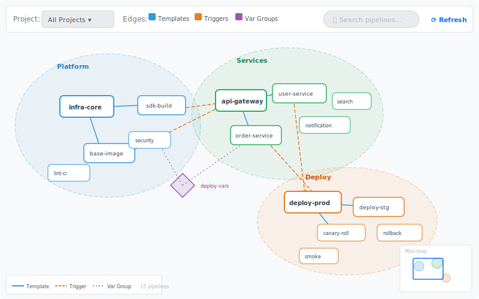

# Feature 10: Org-Wide Pipeline Topology

## Summary

Bird's-eye view of all pipelines across an Azure DevOps organization or project collection. An interactive force-directed (or hierarchical) graph shows inter-pipeline dependencies, shared templates, shared variable groups, and cross-project triggers. Users can filter by project, folder, or dependency type, and zoom into clusters.

## Motivation

Large organizations have hundreds of pipelines spread across dozens of projects. Understanding the dependency web — which pipelines trigger others, which share templates or variable groups, and how cross-project resources connect — is nearly impossible from the Azure DevOps UI alone. A topology view answers questions like:

- "Which pipelines break if I change this shared template?"
- "What is the blast radius of modifying variable group X?"
- "Show me all pipelines in the `infrastructure/` folder that trigger production deployments."

## Data Collection

### Pipeline Discovery

1. **Enumerate projects** — `GET https://dev.azure.com/{org}/_apis/projects?$top=500` (paginated).
2. **Enumerate pipelines per project** — `GET https://dev.azure.com/{org}/{project}/_apis/pipelines?$top=1000`.
3. **Fetch YAML definitions** — For each pipeline, retrieve the root YAML file via the existing `azure-devops.ts` REST client. Use the disk cache (`repo-file-cache.ts`) keyed by commit SHA to avoid redundant fetches.

### Relationship Extraction

Parse each YAML definition using the core package:

| Relationship | Source in YAML | Edge Type |
|---|---|---|
| Template dependency | `template: path@repo` in stages/jobs/steps/variables | `uses-template` |
| Pipeline resource | `resources.pipelines[].pipeline` + `source` | `triggers` / `consumes` |
| Repository resource | `resources.repositories[].repository` | `shares-repo` |
| Variable group | `variables` section with `group:` | `shares-vargroup` |
| Cross-project trigger | `resources.pipelines[].trigger` with `project` | `cross-project-trigger` |

The existing `template-detector.ts` already extracts template references including inside `${{ if }}` blocks. Extend it with a new `detectResourceReferences()` function to also capture `resources.pipelines` and `resources.repositories`.

### Trigger Configuration

Parse trigger/PR trigger sections to identify:

- CI triggers (branch filters)
- Pipeline completion triggers (`resources.pipelines[].trigger`)
- Scheduled triggers (cron)
- `lockBehavior` settings (`sequential` / `runLatest`)

## Graph Layout

### Algorithm

Use a **force-directed layout** (d3-force or elkjs) with:

- **Cluster gravity** — Nodes within the same project are attracted to their project centroid.
- **Edge spring forces** — Weighted by relationship type (template edges are stronger/shorter than trigger edges).
- **Collision avoidance** — Node radii proportional to connection count.
- **Hierarchical fallback** — For DAG-like topologies, offer a Sugiyama/layered layout option via elkjs.

### Visual Encoding

| Element | Visual |
|---|---|
| Pipeline node | Rounded rectangle, size ∝ degree |
| Project cluster | Semi-transparent colored region (convex hull) |
| Template edge | Solid line, blue |
| Trigger edge | Dashed line, orange, with arrow |
| Shared variable group | Diamond node, purple |
| Repository resource | Hexagon node, gray |

### Mini-Map

A fixed-position mini-map in the bottom-right corner shows the full graph at reduced scale with a viewport rectangle the user can drag to pan.

## Filtering & Search

A top bar provides:

- **Project filter** — Multi-select dropdown to show/hide project clusters.
- **Folder filter** — Text input with autocomplete for pipeline folder paths (e.g., `infrastructure/`).
- **Edge type filter** — Checkboxes: Templates, Triggers, Variable Groups, Repositories.
- **Search** — Fuzzy text search across pipeline names. Matching nodes are highlighted; non-matching nodes fade.
- **Degree filter** — Slider to hide low-connectivity nodes (isolate hubs).

## Performance & Lazy Loading

For organizations with 500+ pipelines:

1. **Phased loading** — First load pipeline metadata (names, projects, folders) to render placeholder nodes. Then fetch YAML definitions in background batches of 20, adding edges as relationships are discovered.
2. **Web Workers** — Run YAML parsing and layout computation off the main thread.
3. **Viewport culling** — Only render nodes/edges within the current viewport plus a margin. Use a spatial index (quadtree) for hit testing.
4. **Server-side caching** — Add a new `/api/org-topology` endpoint that caches the full topology graph (pipeline list + extracted relationships) with a 5-minute TTL. Invalidate on webhook or manual refresh.
5. **Incremental updates** — On subsequent loads, only re-fetch pipelines whose `revision` changed.

## Where It Lives

- **New top-level web view** at route `/topology`.
- Accessible from a new nav item in the app header: "Org Topology".
- Separate from the existing per-pipeline template tree view.
- Can deep-link to a filtered view: `/topology?projects=MyProject&edgeTypes=template,trigger`.

## Implementation Plan

### Phase 1 — Data Collection (core + server)

- [ ] Add `detectResourceReferences()` to core package alongside existing `detectTemplateReferences()`.
- [ ] Add `GET /api/org-topology` server endpoint that crawls projects/pipelines/YAML and returns a topology graph JSON.
- [ ] Cache topology graph on disk with TTL.

### Phase 2 — Graph Rendering (web)

- [ ] Create `OrgTopologyView` React component with d3-force layout.
- [ ] Implement project cluster rendering (colored convex hulls).
- [ ] Add edge rendering with type-specific styles.
- [ ] Add mini-map component.

### Phase 3 — Interaction & Polish

- [ ] Filter bar (project, folder, edge type, search).
- [ ] Node click → sidebar with pipeline details + link to template tree view.
- [ ] Viewport culling and Web Worker layout for large graphs.
- [ ] Deep-link support via URL query params.

## Open Questions

1. Should we support Azure DevOps Server (on-prem) in addition to Azure DevOps Services?
2. Rate limiting — how to handle orgs with 1000+ pipelines without hitting ADO API rate limits?
3. Should variable group relationships require fetching variable group definitions via the separate Variable Groups API, or is YAML-level `group:` reference sufficient?
