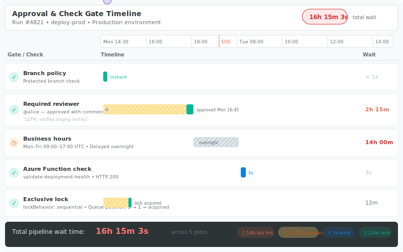

# Feature 11: Approval & Check Gate Timeline




## Summary

A horizontal waterfall visualization of deployment gates and approval checks for a pipeline run or release. Shows who approved, when, how long each gate waited, which checks passed or failed, business-hours delays, and sequential lock contention. Surfaces human bottlenecks and process delays at a glance.

## Motivation

Deployment pipelines often have multiple gates: required reviewers, business-hours restrictions, Azure Function checks, exclusive lock waits, and more. When a deployment takes 18 hours end-to-end but only 4 minutes of actual compute, teams need to understand *where the time went*. Today, this requires clicking through individual check results in the Azure DevOps UI one by one.

This feature answers:

- "Why did the production deployment take so long?"
- "Who was the bottleneck approver?"
- "How much time is lost to business-hours gates per week?"
- "Are sequential lock queues causing cascading delays?"

## Data Sources

### Pipeline Run Stages & Approvals

| API | Data |
|---|---|
| `GET /_apis/pipelines/{id}/runs/{runId}` | Run metadata, stages, timing |
| `GET /_apis/pipelines/{id}/runs/{runId}/approvals` | Approval records: approver, status, timestamps |
| `GET /{project}/_apis/pipelines/checks/runs?$expand=all` | Check suite runs: evaluations, status, timing |
| Stage timeline API | Per-stage start/end times, checkpoint events |

### Environment Checks

Each environment can have multiple check types:

| Check Type | Timing Data |
|---|---|
| **Required approval** | Created → Approved/Rejected timestamps, approver identity |
| **Business hours** | Gate opened → business hours window start |
| **Azure Function / REST API** | Invocation start → response, pass/fail |
| **Invoke Azure Function** | Same as above, with retry intervals |
| **Exclusive lock** | Queued → Lock acquired, with `lockBehavior` (sequential/runLatest) |
| **Branch control** | Instant pass/fail |
| **Template validation** | Instant pass/fail |

### Lock Contention

When `lockBehavior: sequential` is configured, multiple runs queue for the same environment. Fetch the lock queue to show:

- Position in queue at entry time
- Runs ahead in queue (with links)
- Wait duration due to contention

## Timeline Layout

### Horizontal Waterfall Design

```
Time axis →
─────────────────────────────────────────────────────────────────────
 Gate Name           │ Timeline bar                        │ Duration
─────────────────────│────────────────────────────────────│──────────
 Branch policy       │ ██ (instant)                        │ < 1s
 Required reviewer   │ ░░░░░░░░░░░░░████                  │ 2h 15m
 Business hours      │                    ░░░░░░░░░░░░░░░░│ 14h 00m
 Azure Function      │                                  ██│ 3s
─────────────────────────────────────────────────────────────────────
                                          Total wait: 16h 15m 3s
```

- **X-axis**: Absolute time (with day boundaries marked).
- **Y-axis**: One row per gate/check, ordered by start time.
- **Bar encoding**:
  - Solid fill = actively processing / approved.
  - Hatched fill = waiting (human approval pending, business hours block).
  - Green = passed, Red = failed, Yellow = pending, Gray = skipped.
- **Annotations**: Approver name on approval bars, retry count on function checks.

### Aggregate View

For recurring deployments, show an aggregated view:

- Average, P50, P90, P99 wait times per gate type.
- Trend line: is approval latency improving or worsening?
- Heatmap: day-of-week × hour-of-day showing when approvals happen fastest.

## Interaction

### Click Gate for Details

Clicking a gate bar opens a detail panel:

- **Approval gate**: Approver avatar, approval comment, time from request to approval, approval policy (any 1 of N, all required, etc.).
- **Business hours gate**: Configured schedule, exact delay start/end, timezone.
- **Function check**: Request/response payload, HTTP status, retry history.
- **Exclusive lock**: Queue position history, runs ahead, `lockBehavior` setting.

### Hover Tooltips

Hovering a bar shows: gate name, start time, end time, duration, status.

### Time Range Selection

Click-drag on the time axis to zoom into a specific window. Double-click to reset.

### Compare Runs

Select two runs to see side-by-side waterfall comparison — highlights gates that got faster/slower.

## Implementation

### Server

Add new API endpoints:

```
GET /api/approval-timeline/:org/:project/:pipelineId/:runId
```

Response shape:

```typescript
interface ApprovalTimeline {
  run: { id: number; name: string; startTime: string; endTime: string };
  stages: Array<{
    name: string;
    gates: Array<{
      type: 'approval' | 'businessHours' | 'azureFunction' | 'exclusiveLock' | 'branchControl' | 'templateValidation';
      name: string;
      status: 'passed' | 'failed' | 'pending' | 'skipped';
      startTime: string;
      endTime: string | null;
      waitDuration: number; // milliseconds
      details: Record<string, unknown>;
    }>;
  }>;
  totalWaitTime: number;
}
```

The server aggregates data from multiple ADO API calls and caches the result (immutable once the run completes).

### Web Component

- New `ApprovalTimeline` React component.
- Uses a `<canvas>` or SVG for the waterfall bars (better performance for many gates).
- Time axis rendering with d3-scale for proper time formatting and zoom.
- Detail panel as a slide-out drawer.

### Where It Appears

1. **Standalone view** — `/timeline/:org/:project/:pipelineId/:runId` route.
2. **Embedded in template tree** — When viewing a pipeline run, a "Gate Timeline" tab appears alongside the template tree.
3. **Link from ADO** — The URL structure matches ADO's URL pattern so it can be bookmarked/shared.

## Implementation Plan

### Phase 1 — Core Data

- [ ] Implement ADO API calls for approvals, checks, and stage timing in `azure-devops.ts`.
- [ ] Create `/api/approval-timeline` server endpoint with response aggregation.
- [ ] Add caching for completed runs.

### Phase 2 — Waterfall Rendering

- [ ] Build `ApprovalTimeline` component with horizontal bar rendering.
- [ ] Implement time axis with zoom/pan.
- [ ] Color-code bars by gate type and status.
- [ ] Show total wait time summary.

### Phase 3 — Interaction & Details

- [ ] Click-to-expand detail panel per gate.
- [ ] Hover tooltips.
- [ ] Run comparison view.

### Phase 4 — Aggregation (stretch)

- [ ] Aggregate view across multiple runs of the same pipeline.
- [ ] Trend charts and heatmaps.

## Open Questions

1. The Checks API may require additional OAuth scopes — need to verify minimum permissions.
2. For Classic Releases (non-YAML), the API surface is different (`_apis/release/releases`). Should we support both?
3. How far back should the aggregate view look? Last 30 runs? Configurable?
