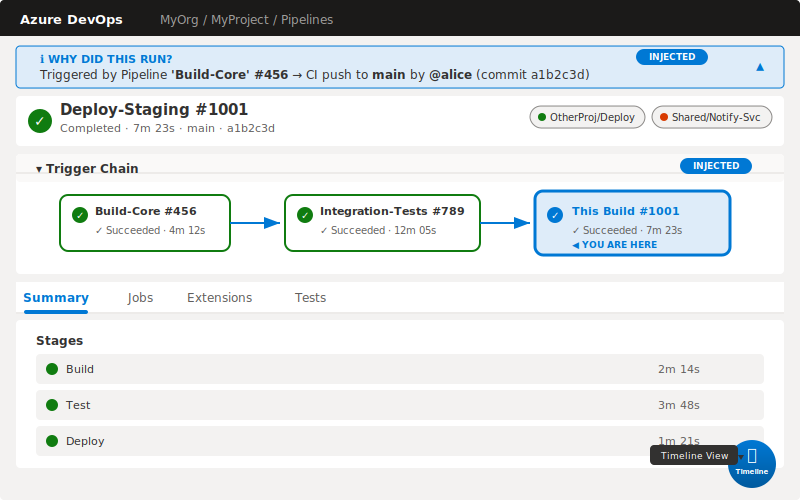

# Feature 13: Chrome Extension — Build Result Page Injection




## Summary

Extend the Azure Pipelines Visualizer Chrome extension beyond the current commit sidebar injection (`.repos-pipeline-status-item`) to inject rich visualization components directly into ADO build result pages (`/_build/results?buildId=N`). Build result pages are where developers spend the most debugging time, making them the highest-value injection target.

## Motivation

- Developers land on build result pages from email notifications, PR checks, and pipeline dashboards — they are the primary debugging surface.
- The native ADO build result UI shows a flat list of tasks but lacks cross-pipeline context: what triggered this build, what it triggers downstream, and how its timeline compares to recent runs.
- The current extension only injects into the commit sidebar, missing the most frequently visited pipeline page.

## Injected Components

### 1. "Why Did This Run?" Explainer Banner

**Location**: Injected as a collapsible `<div>` immediately above the native build header (`.build-detail-header`).

**Content**:
- Trigger source: CI push, PR, scheduled, manual, or pipeline resource trigger.
- Originating actor: username, branch, and commit SHA.
- If pipeline-triggered: link to the upstream build with pipeline name and run number.

**Example**:
> ℹ️ Triggered by Pipeline **Build-Core #456** → CI push to `main` by **@alice** (commit `a1b2c3d`)

**Interaction**: Collapsed by default after first view (remembers preference via `chrome.storage.local`). Click to expand/collapse.

### 2. Trigger Chain Mini-Graph

**Location**: Collapsible panel injected below the explainer banner, above the native tabs (`.build-detail-tabs`).

**Content**:
- Horizontal node-link diagram showing the chain of pipeline triggers.
- Each node displays: pipeline name, run number, status icon (✓/✗/⏳), and duration.
- The current build is highlighted with a distinct border.
- Nodes are clickable — navigates to that build's result page.

**Layout**: Left-to-right flow. Nodes are rounded rectangles connected by directional arrows. Maximum 10 nodes visible with horizontal scroll for longer chains.

**Example chain**:
```
[Build-Core #456 ✓ 4m] → [Integration-Tests #789 ✓ 12m] → [This Build #1001 ⏳ 3m]
```

### 3. Timeline Gantt Overlay

**Location**: Floating action button (FAB) in the bottom-right corner of the build result page.

**Content**:
- Opens a modal overlay with a Gantt chart of the build timeline.
- Each stage/job/task rendered as a horizontal bar with duration labels.
- Color-coded: green (succeeded), red (failed), yellow (running), gray (skipped).
- Hover shows detailed timing: queued → started → completed.
- Comparison mode: overlay the previous run's timeline as ghost bars.

**Interaction**: Click FAB to open, click outside or press Escape to close. Resizable modal.

### 4. Cross-Project Trigger Badges

**Location**: Injected into the build header area, beside the existing status badge.

**Content**:
- Small badges for each cross-project pipeline that this build triggers or is triggered by.
- Badge format: `[ProjectName/PipelineName]` with a status dot (green/red/gray).
- Click navigates to the related build in the other project.

## DOM Injection Points

| Component | Target Selector | Injection Method |
|-----------|----------------|-----------------|
| Explainer Banner | `.build-detail-header` or `[class*="header-bar"]` | `insertBefore` (prepend above header) |
| Trigger Chain | `.build-detail-tabs` or `[role="tablist"]` | `insertBefore` (above tabs) |
| Timeline FAB | `document.body` | `appendChild` (fixed position) |
| Cross-Project Badges | `.build-status-section` or `.secondary-text` near status | `insertAdjacentHTML('afterend')` |

**Robustness**: ADO uses dynamic class names. The extension should:
1. Use multiple fallback selectors (semantic attributes, `data-*`, ARIA roles).
2. Use a `MutationObserver` on the page body to detect when the build detail view renders (ADO is a SPA — content loads asynchronously).
3. Retry injection up to 5 times with exponential backoff if the target element is not yet present.

## Data Fetching

Reuse the existing ADO REST API helpers from the extension's background script:

| Data Need | API Endpoint | Notes |
|-----------|-------------|-------|
| Build details | `GET /_apis/build/builds/{buildId}` | Trigger info, source branch, requestedFor |
| Build timeline | `GET /_apis/build/builds/{buildId}/timeline` | Stage/job/task timing for Gantt |
| Triggered builds | `GET /_apis/build/builds?reasonFilter=triggered&triggerInfo.buildId={buildId}` | Downstream builds |
| Triggering build | Parsed from `build.triggerInfo` | Upstream build reference |
| Cross-project triggers | `GET /_apis/build/builds/{buildId}` on linked projects | Requires cross-project PAT scope |

**Caching**: Cache build details and timeline in `chrome.storage.local` keyed by `{org}/{project}/build/{buildId}`. TTL: 5 minutes for in-progress builds, 24 hours for completed builds.

## Styling

- Use ADO's native CSS custom properties (`--communication-foreground`, `--palette-primary`, etc.) for colors.
- Match ADO's Fluent UI component patterns: rounded corners, subtle shadows, consistent spacing.
- All injected elements use a `apv-ext-` CSS class prefix to avoid conflicts.
- Dark/light theme: read from ADO's `body[data-theme]` attribute and apply corresponding styles.
- Font: inherit from the page (`var(--font-family)`).

## Performance Considerations

1. **Lazy loading**: Only fetch trigger chain data when the panel is expanded. Timeline data fetched only when FAB is clicked.
2. **Debounced observer**: The `MutationObserver` callback is debounced (200ms) to avoid excessive injection attempts during SPA navigation.
3. **Minimal DOM**: Use lightweight inline SVG for the trigger chain graph instead of a full charting library.
4. **Memory**: Disconnect the `MutationObserver` once injection succeeds. Re-attach on SPA URL changes via `chrome.webNavigation.onHistoryStateUpdated`.
5. **Bundle size**: Tree-shake the injected content script. Target < 50KB gzipped for all build page injection code.

## User Preferences

Exposed in the extension popup:

- Toggle each component on/off independently.
- Default collapsed/expanded state for the explainer banner and trigger chain.
- Timeline comparison mode on/off by default.

## Rollout Plan

1. **Phase 1**: Explainer banner + trigger chain (highest value, lowest complexity).
2. **Phase 2**: Timeline Gantt overlay (requires more complex rendering).
3. **Phase 3**: Cross-project trigger badges (requires additional API permissions).

## Open Questions

- Should the trigger chain show the full transitive closure or limit depth (e.g., 3 levels)?
- How to handle builds with multiple triggers (e.g., scheduled + pipeline resource)?
- Should the Gantt overlay support exporting as an image or CSV?
